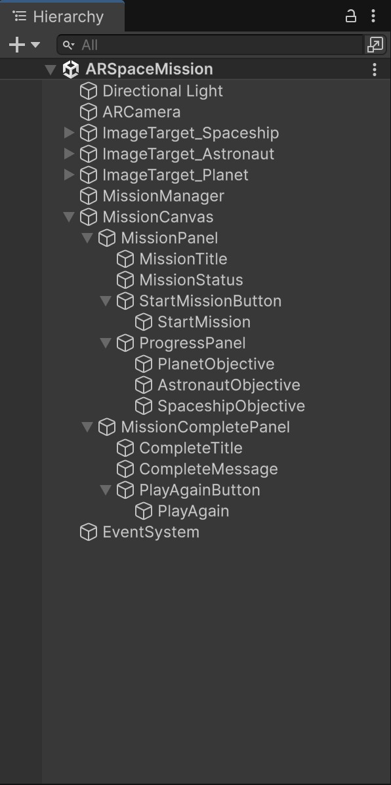

# Space Mission Game - Unity AR Game

An interactive Augmented Reality (AR) space mission oriented game developed with **Unity**, **Vuforia Engine**, and **C#**.

The application allows the user to discover and interact with virtual space objects by scanning physical image cards with a camera. The three main AR targets represent: 
- **Planet**
- **Astronaut**
- **Spaceship**.

When a target is recognized by the camera, the corresponding 3D model is displayed in the real-world environment.

**Mission Goal:** The user must complete a sequence of objectives in order to finish the mission.

---

# Features

* Recognition of three different AR image targets using Vuforia Engine
* Three corresponding 3D models
* Simultaneous recognition of multiple targets
* Target tracking using Vuforia + Extended tracking support
* User interaction with the AR objects
* Interactive Planet activation
* Persistent Planet behavior after activation
* Astronaut visual reaction after becoming an active mission objective
* Sequential mission objectives
* Mission state management
* Mission progress indicators
* Start Mission functionality
* Mission Complete screen
* Play Again functionality
* Dynamic UI status messages
* Visual feedback for completed objectives

---

# Technologies Used

- Unity
- Vuforia Engine
- C#

---

# Game Flow

1. Run the application
2. A panel shows up indicating the first action required -> **Find all three targets!**
3. The user detects all 3 AR targets by pointing the physical cards to the camera
4. **Clich here to Start the Mission** is displayed letting the user begin the mission
5. The user should complete all the objectives in order to finish the mission successfully
5. Such objectievs are to **Find the Planet** | **Find the Astronaut** || **Find the Spaceship**
6. The user has the option to **Play Again**

---

# Mission States:

## Waiting

The application is waiting for all three AR targets to be detected.

The start mission option remains hidden.

## Ready

All three targets have been detected.

The user is able to start the mission.

## MissionActive

The mission has started.

The application displays the mission progress and activates the objectives sequentially.

## MissionComplete

All mission objectives have been completed.

The user can restart the mission using the **Click here to Play Again** option.

---

# Project Structure

The Unity project follows the standard Unity project structure.

```text
ARSpaceMission/
│
├── Assets/
│   ├── Scenes/
│   ├── Scripts/
│   ├── Settings/
│   └── ...
│
├── Packages/
│   ├── manifest.json
│   └── com.ptc.vuforia.engine-11.4.4.tgz
│
├── ProjectSettings/
│
├── QCAR/
│
├── .gitignore
├── README.md
└── ...
```

---

# Scene Architecture



---

# Mission System

The mission logic is centralized in the `MissionManager`.

This prevents the individual AR objects from independently deciding whether the mission has been completed.

The MissionManager maintains the current mission state and objective completion status.

---

# Objective 1 – Activate the Planet

When the Planet is clicked:

1. The interaction is detected.
2. The MissionManager is notified.
3. The Planet objective is completed.
4. The Planet is activated.
5. The Planet begins rotating.
6. The next objective becomes available.

The UI changes from **#1: Activate the Planet** to **Done: Activate the Planet**

---

# Objective 2 – Find the Astronaut

The user must present the Astronaut target to the camera.

1. The MissionManager receives the detection event.
2. The Astronaut objective is completed.
3. The Astronaut visual behavior is activated.
4. The next objective becomes available.

The objective changes accodingly.

---

# Objective 3 – Find the Spaceship

After the Astronaut has been found, the user must detect the Spaceship target.

1. The MissionManager receives the detection event.
2. The Spaceship objective is completed.
3. The mission is marked as completed.
4. The MissionComplete panel is displayed.

The objective changes accodingly.

---

# Mission Complete Screen

After all three objectives are completed, the main mission interface is replaced by the mission completed screen. The **Click here to Play Again** button reloads the active Unity scene and allows the user to repeat the mission.

---

# Setup Instructions

## Requirements

To run the project locally, the following are required:

* Unity
* A compatible Unity version matching the project configuration
* Vuforia Engine
* A device or camera capable of viewing the AR targets

## 1. Clone the Repository

Clone the repository

```bash
git clone https://github.com/HristiyanBratov/AR-Space-Mission-Game.git
```

```bash
cd ARSpaceMission
```

---

## 2. Open the Project in Unity

Open Unity Hub and select:

```text
Add → Add project from disk
```

Select the cloned project directory.

Unity will import the project and its available packages.

---

# Vuforia Package Requirement

An important part of this project is the Vuforia Engine package.

The project references Vuforia through the Unity Package Manager.

The `Packages/manifest.json` file contains a dependency similar to:

```json
"com.ptc.vuforia.engine": "file:com.ptc.vuforia.engine-11.4.4.tgz"
```

This means Unity expects the following package file to exist locally.

## Important

The `.tgz` package is intentionally excluded from Git because of its size.

Therefore, cloning the repository alone is **not sufficient** to restore the complete project.

After cloning the repository, the Vuforia package must be obtained separately and placed in the `Packages` directory.

The expected structure is:

```text
ARSpaceMission/
│
├── Packages/
│   ├── manifest.json
│   ├── packages-lock.json
│   └── com.ptc.vuforia.engine-11.4.4.tgz
│
└── ...
```

If the `.tgz` file is missing, Unity will not be able to resolve the Vuforia dependency correctly.


## Obtaining the Vuforia Package

The Vuforia Engine package should be obtained through the official Vuforia distribution/development process corresponding to the version used by this project.

After obtaining the package:

1. Copy `com.ptc.vuforia.engine-11.4.4.tgz`.
2. Place it inside the project's `Packages` directory.
3. Open the project with Unity.
4. Allow Unity Package Manager to resolve the dependency.

Do not rename the package unless the corresponding path in `Packages/manifest.json` is changed as well.

---

 ## 3. Running the Project

After the project has been compiled successfully - Press **Play** in Unity.

---

# Testing

## Test 1 – AStronaut/Planet/Spaceship Target

**Action:** Present any single image target to the camera.

**Expected result:**

* Vuforia recognizes the target.
* The object appears.

**Result:** Passed.

---

## Test 2 – Multiple Targets

**Action:** Present multiple image targets to the camera.

**Expected result:**

* Multiple targets can be recognized.
* Their corresponding objects are displayed.

**Result:** Passed.

---

## Test 3 – Planet Objective

**Action:** Start the mission and interact with the Planet.

**Expected result:**

* Planet objective becomes completed.
* Planet starts rotating.
* Planet remains visible after the target is no longer directly visible.
* Astronaut becomes the next objective.

**Result:** Passed.

---

## Test 4 – Astronaut Objective

**Action:** Detect the Astronaut after completing the Planet objective.

**Expected result:**

* Astronaut objective becomes completed.
* Astronaut visual behavior is activated.
* Spaceship becomes the next objective.

**Result:** Passed.

---

## Test 5 – Spaceship Objective

**Action:** Detect the Spaceship after completing the Astronaut objective.

**Expected result:**

* Spaceship objective becomes completed.
* Mission transitions to `Mission Completed Screne`.

**Result:** Passed.

---

## Test 6 – Mission Complete Screen

**Action:** Complete all three objectives.

**Expected result:**

* Main mission panel disappears.
* Mission Complete panel appears.
* Play Again button is available.

**Result:** Passed.

---

## Test 7 – Play Again

**Action:** Press Play Again.

**Expected result:**

* The scene is reloaded.
* Mission state is reset.
* The user can start the mission again.

**Result:** Passed.

---

Author: Hristiyan Bratov
